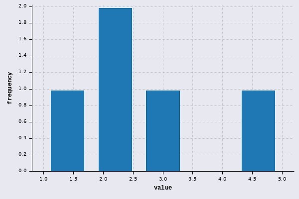
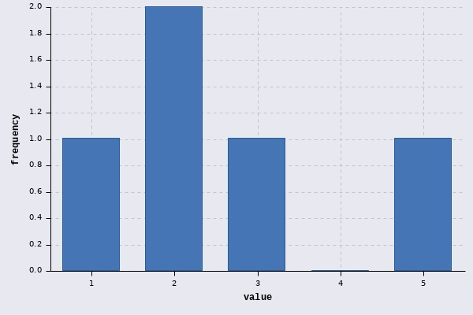
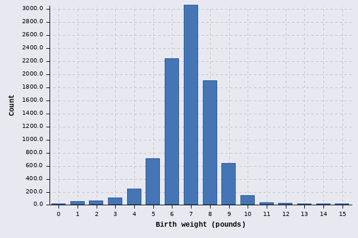
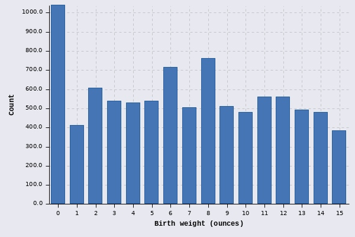
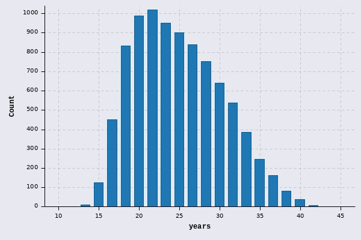
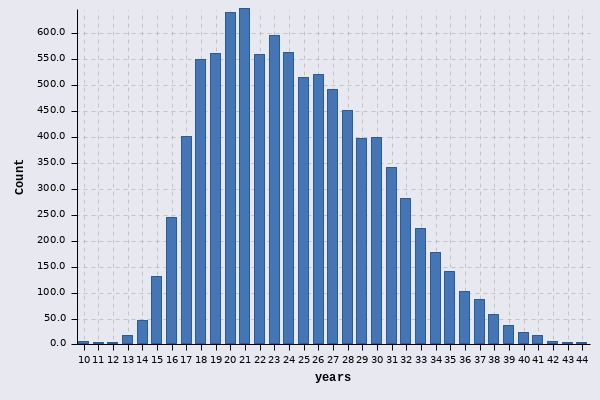
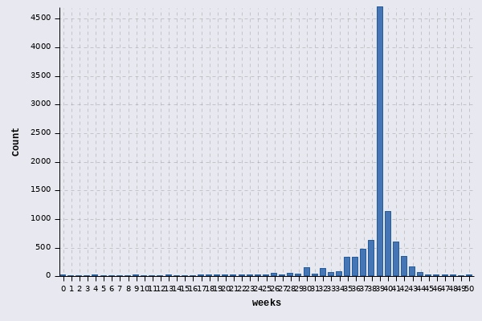
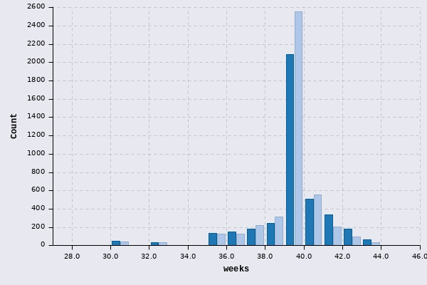

# Think Stats 2e

Clojure version of examples and excercises from [notebook](https://github.com/AllenDowney/ThinkStats2/blob/master/code/chap02ex.ipynb) and [book chapter](http://greenteapress.com/thinkstats2/html/thinkstats2003.html).
Please read the book/notebook before. 

Read [approach.md]() first for all information about assumptions and libraries used.

## Chapter 2

Namespaces used:

* `data.tablesaw` - simple wrapper for Tablesaw, java dataframe library
* `data.stata` - stata files interpreter and loader
* `nsfg` - loads and cleans NSFG datasets used here
* `plot` - wrapper for `cljplot` library
* `cljplot.core` - show/save chart
* `fastmath.stats` - statistical functions
* `fastmath.random` - distribution functions
* `fastmath.core` - general math functions
* `clojure.set` - to operate on row selections
```clojure
(ns thinkstats-clj.chapter02
  (:require [thinkstats-clj.data.tablesaw :as ts]
            [thinkstats-clj.data.stata :as stata]
            [thinkstats-clj.nsfg :as nsfg]
            [thinkstats-clj.plot :refer :all]
            [cljplot.core :refer :all]
            [fastmath.stats :as stats]
            [fastmath.random :as rnd]
            [fastmath.core :as m]
            [clojure.set :as set]))
```
### Histograms


```clojure
(def t [1 2 2 3 5])
```


Histograms in fastmath work on continuous range.
```clojure
(stats/histogram t 5)
```

```clojure
=> {:size 5,
    :step 0.8,
    :samples 5,
    :min 1.0,
    :max 5.0,
    :bins
    ([1.0 1 0.2]
     [1.8 2 0.4]
     [2.6 1 0.2]
     [3.4000000000000004 0 0.0]
     [4.2 1 0.2])}
```


For discrete values use let's use `frequencies` function.
```clojure
(def hist (frequencies t))
```

```clojure
hist
;; => {1 1, 2 2, 3 1, 5 1}
```

```clojure
=> {1 1, 2 2, 3 1, 5 1}
```

```clojure
(hist 2)
```

```clojure
=> 2
```

```clojure
(hist 4)
```

```clojure
=> nil
```

```clojure
(get hist 4 0)
```

```clojure
=> 0
```

```clojure
(keys hist)
```

```clojure
=> (1 2 3 5)
```


Show histogram with continuous scale
```clojure
(save-and-show (histogram t {:bins 5 :xlabel "value" :ylabel "frequency" :percents? false})
               "ch02/histogram-cont.jpg")
```



Show barchar versions
```clojure
(save-and-show (histogram-discrete t {:xlabel "value" :ylabel "frequency"})
               "ch02/histogram-bars.jpg")
```


### Data visualizations


Let's load pregnancy database and select ids which represent live birhts.


```clojure
(def preg (nsfg/fem-preg))
(def live-ids (set (.isEqualTo (ts/column preg "outcome") 1.0)))
```


Verify number of live births (from first.py)
```clojure
(assert (= 9148 (count live-ids)))
```


`ts/select-values` is function which takes given selector (list of ids) and returns corresponding data from given column. Show lbs first
```clojure
(save-and-show (histogram-discrete (ts/select-values preg "birthwgt_lb" live-ids)
                                   {:xlabel "Birth weight (pounds)" :ylabel "Count"})
               "ch02/histogram-birthwgt-lb.jpg")
```



and oz values
```clojure
(save-and-show (histogram-discrete (ts/select-values preg "birthwgt_oz" live-ids)
                                   {:xlabel "Birth weight (ounces)" :ylabel "Count"})
               "ch02/histogram-birthwgt-oz.jpg")
```



Age of respondent during pregnancy (continuous x-axis)


```clojure
(def ages (ts/select-values preg "agepreg" live-ids))
(save-and-show (histogram ages {:percents? false :bins 20 :xlabel "years" :ylabel "Count" :y {:fmt int} :x {:fmt int}})
               "ch02/histogram-agepreg.jpg")
```



discrete version


```clojure
(def ages-int (map #(int (m/floor %)) ages))
(save-and-show (histogram-discrete ages-int {:xlabel "years" :ylabel "Count"})
               "ch02/histogram-agepreg-bars.jpg")
```



Select length of pregnancy


```clojure
(def pregnancy-length (map #(int (m/floor %)) (ts/select-values preg "prglngth" live-ids)))
(save-and-show (histogram-discrete pregnancy-length {:y {:fmt int} :xlabel "weeks" :ylabel "Count"})
               "ch02/histogram-prglngth.jpg")
```



shortest pregnancy lengths
```clojure
(take 10 (sort-by first (frequencies ages-int)))
```

```clojure
=> ([10 2]
    [11 1]
    [12 1]
    [13 14]
    [14 43]
    [15 128]
    [16 242]
    [17 398]
    [18 546]
    [19 559])
```


longest pregnancy lengths
```clojure
(take-last 10 (sort-by first (frequencies pregnancy-length)))
```

```clojure
=> ([40 1116]
    [41 587]
    [42 328]
    [43 148]
    [44 46]
    [45 10]
    [46 1]
    [47 1]
    [48 7]
    [50 2])
```


Create selectors for first birth and other births


```clojure
(def firsts (set/intersection live-ids (set (.isEqualTo (ts/column preg "birthord") 1.0))))
(def others (set/intersection live-ids (set (.isNotEqualTo (ts/column preg "birthord") 1.0))))
```


Assert length values (from first.py)


```clojure
(assert (= 4413 (count firsts)))
(assert (= 4735 (count others)))
```


Select pregnancy lengths for first and other babies


```clojure
(def pregnancy-length-first (ts/select-values preg "prglngth" firsts))
(def pregnancy-length-other (ts/select-values preg "prglngth" others))
```

```clojure
(save-and-show (histogram [pregnancy-length-first pregnancy-length-other]
                          {:xlabel "weeks" :ylabel "Count" :bins 50 :percents? false :y {:fmt int} :x {:domain [27 46]}})
               "ch02/prglngth-fst-oth.jpg")
```



mean of pregnancy length
```clojure
(stats/mean pregnancy-length)
```

```clojure
=> 38.56055968517709
```

```clojure
(stats/stddev pregnancy-length)
```

```clojure
=> 2.7023438100705963
```

```clojure
(stats/variance pregnancy-length)
```

```clojure
=> 7.302662067826868
```

```clojure
[(stats/mean pregnancy-length-first) (stats/mean pregnancy-length-other)]
```

```clojure
=> [38.60095173351461 38.52291446673706]
```

```clojure
(- (stats/mean pregnancy-length-first) (stats/mean pregnancy-length-other))
```

```clojure
=> 0.07803726677754952
```

```clojure
(stats/cohens-d pregnancy-length-first pregnancy-length-other)
```

```clojure
=> 0.028879044654449862
```

EXCERCISES


```clojure
(def weight (ts/select-values preg "totalwgt_lb" live-ids))
(def weight-first (ts/select-values preg "totalwgt_lb" firsts))
(def weight-other (ts/select-values preg "totalwgt_lb" others))
```

```clojure
(show (histogram [weight-first weight-other]
                 {:xlabel "weight (lbs)" :ylabel "Count" :bins 30 :percents? false :y {:fmt int}}))
```

```clojure
(- (stats/mean weight-first) (stats/mean weight-other))
```

```clojure
=> -0.12476118453548768
```

```clojure
(stats/cohens-d weight-first weight-other)
```

```clojure
=> -0.0886723633320275
```

```clojure
(def resp (nsfg/fem-resp))
```


```clojure
(show (histogram-discrete (ts/column resp "totincr") {:xlabel "total income" :ylabel "Count"}))
(show (histogram-discrete (ts/column resp "age_r") {:xlabel "respondent age" :ylabel "Count"}))
(show (histogram-discrete (ts/column resp "numfmhh") {:xlabel "number of people in household" :ylabel "Count"}))
(show (histogram-discrete (ts/column resp "parity") {:xlabel "number of childern born" :ylabel "Count"}))
```

```clojure
(take-last 4 (sort-by first (frequencies (ts/column resp "parity"))))
```

```clojure
=> ([9 2] [10 3] [16 1] [22 1])
```


```clojure
(def parities-max-income (ts/select-values resp "parity" (.isEqualTo (ts/column resp "totincr") 14.0)))
(def parities-other-income (ts/select-values resp "parity" (.isNotEqualTo (ts/column resp "totincr") 14.0)))
```


```clojure
(show (histogram-discrete parities-max-income {:xlabel "number of childern born (income >= $75k)" :ylabel "Count"}))
(show (histogram-discrete parities-other-income {:xlabel "number of childern born (income <= $75k)" :ylabel "Count"}))
```

```clojure
(take-last 4 (sort-by first (frequencies parities-max-income)))
```

```clojure
=> ([4 19] [5 5] [7 1] [8 1])
```

```clojure
(- (stats/mean parities-max-income) (stats/mean parities-other-income))
```

```clojure
=> -0.17371374470099554
```

```clojure
(stats/cohens-d parities-max-income parities-other-income)
```

```clojure
=> -0.12511855314660628
```
mode


```clojure
(stats/mode pregnancy-length)
```

```clojure
=> 39.0
```


are there more modes?
```clojure
(stats/modes pregnancy-length)
```

```clojure
=> (39.0)
```


find number of samples for mode
```clojure
((frequencies pregnancy-length) (int (stats/mode pregnancy-length)))
```

```clojure
=> 4693
```
first vs others analysis


```clojure
(let [mean0 (stats/mean weight)
      mean1 (stats/mean weight-first)
      mean2 (stats/mean weight-other)
      diff (- mean1 mean2)]
  {:weight-mean mean0
   :first-babies-mean mean1
   :other-babies-mean mean2
   :weight-variance (stats/variance weight)
   :first-babies-variance (stats/variance weight-first)
   :other-babies-variance (stats/variance weight-other)
   :difference-lbs diff
   :difference-oz (* 16.0 diff)
   :difference-relative-to-mean-% (* 100.0 (/ diff mean0))
   :cohens-d (stats/cohens-d weight-first weight-other)})
```

```clojure
=> {:cohens-d -0.0886723633320275,
    :other-babies-variance 1.943781025896453,
    :first-babies-variance 2.018027300915775,
    :difference-lbs -0.12476118453548768,
    :other-babies-mean 7.325855614973261,
    :difference-relative-to-mean-% -1.7171423678372044,
    :first-babies-mean 7.201094430437774,
    :weight-mean 7.26562845762337,
    :weight-variance 1.9832904288326525,
    :difference-oz -1.9961789525678029}
```
