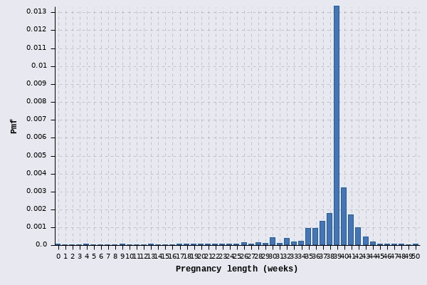
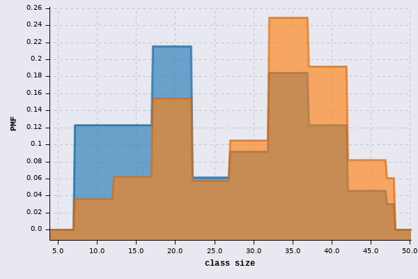

# Think Stats 2e

Clojure version of examples and excercises from [notebook](https://github.com/AllenDowney/ThinkStats2/blob/master/code/chap03ex.ipynb) and [book chapter](http://greenteapress.com/thinkstats2/html/thinkstats2004.html.
Please read the book/notebook before. 

Read [approach.md]() first for all information about assumptions and libraries used.

## Chapter 3

Namespaces used:

* `data.tablesaw` - simple wrapper for Tablesaw, java dataframe library
* `data.stata` - stata files interpreter and loader
* `nsfg` - loads and cleans NSFG datasets used here
* `plot` - wrapper for `cljplot` library
* `cljplot.core` - show/save chart
* `fastmath.stats` - statistical functions
* `fastmath.random` - random functions and distributions
* `fastmath.interpolation` - interpolator functions
* `fastmath.core` - general math functions
* `clojure.set` - to operate on row selections
* `clojure2d.color` - color functions and presets
```clojure
(ns thinkstats-clj.chapter03
  (:require [thinkstats-clj.data.tablesaw :as ts]
            [thinkstats-clj.data.stata :as stata]
            [thinkstats-clj.nsfg :as nsfg]
            [thinkstats-clj.plot :as plot]
            [cljplot.core :refer :all]
            [fastmath.stats :as stats]
            [fastmath.random :as rnd]
            [fastmath.core :as m]
            [fastmath.interpolation :as in]
            [clojure.set :as set]
            [clojure2d.color :as c]))
```
### PMF

PMFs are used for discrete data, here they can be calculated via histograms with `:percents?` set to true or by using `:enumerated` distribution.


Load data and build selector for live births


```clojure
(def preg (nsfg/fem-preg))
(def live-ids (set (.isEqualTo (ts/column preg "outcome") 1.0)))
```


Display birth weights for live births as frequencies
```clojure
(plot/save-and-show (plot/histogram-discrete (ts/select-values preg "birthwgt_lb" live-ids)
                                             {:xlabel "Birth weight (pounds)" :ylabel "Count"})
                    "ch03/histogram-counts.jpg")
```


And as PMF
```clojure
(plot/save-and-show (plot/histogram-discrete (ts/select-values preg "birthwgt_lb" live-ids)
                                             {:xlabel "Birth weight (pounds)" :ylabel "Count" :percents? true})
                    "ch03/histogram-pmf.jpg")
```


PMF can be build using `pdf` on `:enumerated-int` distribution from Apache Commons Math. There are no operations like `Mult` or `Incr` like in original notebook. The other strategy will be used later.


```clojure
(def pmf (rnd/distribution :enumerated-int {:data [1 2 2 3 5]}))
(rnd/pdf pmf 2)
```

```clojure
=> 0.4
```


Load pregnancy length.
```clojure
(def pregnancy-length (map #(int (m/floor %)) (ts/select-values preg "prglngth" live-ids)))
```


as bar chart
```clojure
(plot/save-and-show (plot/histogram-discrete pregnancy-length {:xlabel "Pregnancy length (weeks)" :ylabel "Pmf" :percents? true})
                    "ch03/hist-preg-length.jpg")
```



as pmf (it done using step interpolation internally)
```clojure
(plot/save-and-show (plot/pmf-int pregnancy-length {:xlabel "Pregnancy length (weeks)" :ylabel "Pmf" :samples 500 :stroke {:size 3}})
                    "ch03/hist-preg-pmf.jpg")
```

```clojure
=> ""
```


Prepare first and other birhts selectors


```clojure
(def firsts (set/intersection live-ids (set (.isEqualTo (ts/column preg "birthord") 1.0))))
(def others (set/intersection live-ids (set (.isNotEqualTo (ts/column preg "birthord") 1.0))))
```


Get data (pregnancy length)


```clojure
(def pregnancy-length-first (ts/select-values preg "prglngth" firsts))
(def pregnancy-length-other (ts/select-values preg "prglngth" others))
```


Prepare distributions to get PMF (PDF) functions


```clojure
(def first-pmf (rnd/distribution :enumerated-int {:data pregnancy-length-first}))
(def other-pmf (rnd/distribution :enumerated-int {:data pregnancy-length-other}))
```


Compare pregnancy lengths
```clojure
(plot/save-and-show (plot/histogram [pregnancy-length-first pregnancy-length-other]
                                    {:xlabel "Pregnancy length(weeks)" :ylabel "Count" :bins 50 :percents? true :x {:domain [27 46]}})
                    "ch03/preg-lengths-bars.jpg")
```


```clojure
(plot/save-and-show (plot/pmf-int [pregnancy-length-first pregnancy-length-other]
                                  {:xlabel "Pregnancy length(weeks)" :stroke {:size 3} :samples 500 :ylabel "Count" :domain [27 46]})
                    "ch03/preg-lengths-pmf.jpg")
```


Calculate PMFs differences
```clojure
(def preg-diffs (map #(let [p1 (rnd/pdf first-pmf %)
                            p2 (rnd/pdf other-pmf %)]
                        [% (* 100.0 (- p1 p2))]) (range 35 46)))
```


Display differences as bar charts.
```clojure
(plot/save-and-show (plot/vbar preg-diffs {:xlabel "Pregnancy length(weeks)" :ylabel "Difference (percentage points)"})
                    "ch03/preg-diffs.jpg")
```


###  Biasing and ubiasing PMFs


Let's store frequency table under `d` var
```clojure
(def d {7 8, 12 8, 17 14, 22 4, 27 6, 32 12, 37 8, 42 3, 47 2})
```


To build PMF we have to gather row samples and feed in `:enumerated-int` distribution.
```clojure
(def d-pmf (rnd/distribution :enumerated-int {:data (mapcat (fn [[k v]] (repeat v k)) d)}))
```


`:enumerated-int` distribution allows to give probabilities for each value, this way we can multiply (bias) probabilities in our case. Fortunately, probabilities do not need to be normalized. Distribution function will make it for us.
```clojure
(def biased-pmf
  (let [biased-probs (map #(* % (rnd/pdf d-pmf %)) (keys d))]
    (rnd/distribution :enumerated-int {:data (keys d) :probabilities biased-probs})))
```


Get `mean` from PMF
```clojure
(rnd/mean d-pmf)
```

```clojure
=> 23.6923076923077
```


Get `mean` from biased PMF
```clojure
(rnd/mean biased-pmf)
```

```clojure
=> 29.123376623376625
```


To unbiased, we do reverse (division) opearation on probabilites.
```clojure
(def unbiased-pmf
  (let [biased-probs (map #(/ (rnd/pdf biased-pmf %) %) (keys d))]
    (rnd/distribution :enumerated-int {:data (keys d) :probabilities biased-probs})))
```


Get `mean`. It's actually the same as original one
```clojure
(rnd/mean unbiased-pmf)
```

```clojure
=> 23.69230769230769
```


Compare original and biased PMFs. You can see, that PMFs are spikes, to get step chart we do the trick of calculating points and draw interpolated line function later.
```clojure
(plot/save-and-show (plot/functions {:regular (partial rnd/pdf d-pmf)
                                     :biased (partial rnd/pdf biased-pmf)}
                                    {:xlabel "class size" :stroke {:size 3} :samples 500 :ylabel "PMF" :domain [6 48]})
                    "ch03/biased-unbiased.jpg")
```

```clojure
=> 
```
Create [x,y] points from PMF
```clojure
(defn build-pmf-points
  ([pmf ks] (build-pmf-points pmf ks nil))
  ([pmf ks extra] (map #(vector % (rnd/pdf pmf %)) (sort (concat extra ks)))))
```


Draw `line` chart with interpolated (step) area chart.
```clojure
(plot/save-and-show (plot/lines {:regular (build-pmf-points d-pmf (keys d) [6 48])
                                 :biased (build-pmf-points biased-pmf (keys d) [6 48])}
                                {:xlabel "class size" :ylabel "PMF" :stroke {:size 3} :area? true :interpolation in/step-after})
                    "ch03/biased-unbiased-step.jpg")
```



Draw original and unbiased PMFs to see that they are the same.
```clojure
(plot/save-and-show (plot/lines {:regular (build-pmf-points d-pmf (keys d) [6 48])
                                 :unbiased (build-pmf-points unbiased-pmf (keys d) [6 48])}
                                {:xlabel "class size" :ylabel "PMF" :stroke {:size 3} :interpolation in/step-after})
                    "ch03/orig-unbiased.jpg")
```


### Tablesaw indexing


Let's create two columns and pack into the table


```clojure
(def A (ts/double-column "A" (repeatedly 4 rand)))
(def B (ts/double-column "B" (repeatedly 4 rand)))
(def df (ts/columns->table "DF" [A B]))
```

```clojure
(ts/shape df)
```

```clojure
=> {:columns 2, :rows 4}
```

```clojure
(println (ts/echo-md df))
```
A|B
---|---
0.8297075819163603|0.6003089206863399
0.6759360731890423|0.8524540937333327
0.41251978272776113|0.8357362776953716
0.5574892435573884|0.218912973051949


```clojure
(.columnNames df)
```

```clojure
=> ["A" "B"]
```

```clojure
(println (ts/echo-md (ts/rows df [0 1])))
```
A|B
---|---
0.8297075819163603|0.6003089206863399
0.6759360731890423|0.8524540937333327


```clojure
(seq (ts/column df "A"))
```

```clojure
=> (0.05361782177063856 0.588401022515685 0.33809777615269954 0.06817524190143731)
```

```clojure
(seq (ts/column df "B"))
```

```clojure
=> (0.03300586798260763 0.06113687619219055 0.9233553560506165 0.18856099600248988)
```

```clojure
(type (ts/column df "A"))
```

```clojure
=> tech.tablesaw.api.DoubleColumn
```


get from [0,0]
```clojure
(.get (ts/column df 0) 0)
```

```clojure
=> 0.05361782177063856
```
### Excercises


Load respondents and select number of children under 18 yo


```clojure
(def resp (nsfg/fem-resp))
(def numkdhh (ts/column resp "numkdhh"))
(def numkdhh-vals (distinct (seq numkdhh)))
```

```clojure
(plot/save-and-show (plot/histogram-discrete numkdhh {:xlabel "number of childern" :ylabel "pmf" :percents? true})
                    "ch03/numkdhh-hist-bar.jpg")
```


Create distribution from data
```clojure
(def numkdhh-pmf (rnd/distribution :enumerated-int {:data numkdhh}))
```


Bias data
```clojure
(def biased-numkdhh-pmf
  (let [biased-probs (map #(* % (rnd/pdf numkdhh-pmf %)) numkdhh-vals)]
    (rnd/distribution :enumerated-int {:data numkdhh-vals :probabilities biased-probs})))
```
#### Statistics


lets compare distribution statistics and data statistics, should be the same
```clojure
(stats/mean numkdhh)
```


=> 1.0242051550438314
```clojure
(rnd/mean numkdhh-pmf)
```


=> 1.024205155043831
```clojure
(stats/variance numkdhh)
```


=> 1.4130492078405363
```clojure
(stats/population-variance numkdhh)
```


=> 1.4128643263531833
```clojure
(rnd/variance numkdhh-pmf)
```

```clojure
=> 1.4128643263531195
```

```clojure
(rnd/mean biased-numkdhh-pmf)
```

```clojure
=> 2.403679100664282
```

```clojure
(plot/save-and-show (plot/lines {:regular (build-pmf-points numkdhh-pmf numkdhh-vals)
                                 :biased (build-pmf-points biased-numkdhh-pmf numkdhh-vals)}
                                {:xlabel "number-of-childern" :ylabel "PMF" :stroke {:size 3} :area? true :interpolation in/step-after})
                    "ch03/num-of-ch-biased-unbiased.jpg")
```


#### Are first babies late?


Load pregnancies longer or equal 37 weeks
```clojure
(def pregnancy-length>=37 (set (.isGreaterThanOrEqualTo (ts/column preg "prglngth") 37.0)))
```


Find selector for women giving more than one birth
```clojure
(def more-kids-ids (->> (nsfg/preg-map preg (set/intersection pregnancy-length>=37 live-ids)) 
                        (filter (comp #(> % 1) count second))
                        (map second)))
```


Load pregnancy length column
```clojure
(def prglngth (ts/column preg "prglngth"))
```
Find differences between first and other birhts
```clojure
(defn differences
  [ks]
  (let [f (.get prglngth (first ks))]
    (map #(- f (.get prglngth %)) (rest ks))))
```


create diffs
```clojure
(def diffs (mapcat differences more-kids-ids))
```


and check mean
```clojure
(stats/mean diffs)
```

```clojure
=> 0.1885057471264353
```

```clojure
(plot/save-and-show (plot/histogram-discrete diffs {:xlabel "difference in weeks" :ylabel "PMF" :bins 30 :percents? true})
                    "ch03/difference-births.jpg")
```


TODO last excercise

