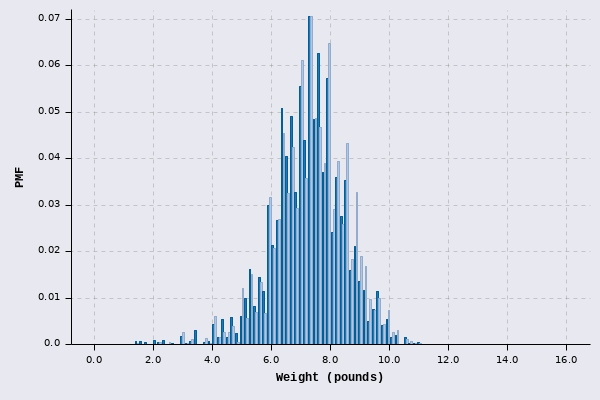
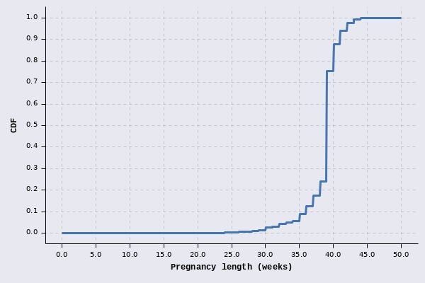
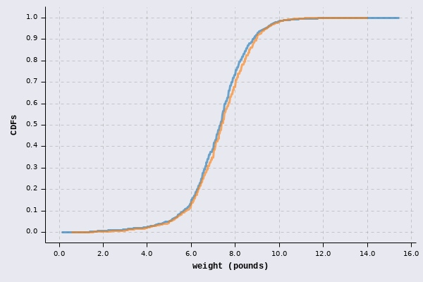
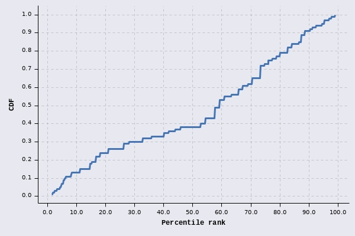
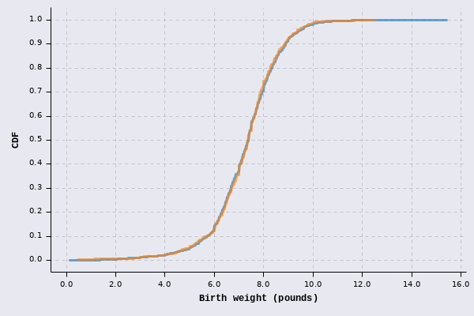
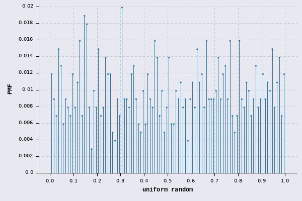
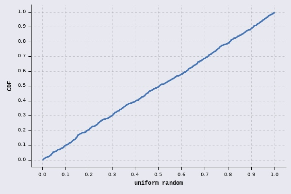

# Think Stats 2e

Clojure version of examples and excercises from [notebook](https://github.com/AllenDowney/ThinkStats2/blob/master/code/chap03ex.ipynb) and [book chapter](http://greenteapress.com/thinkstats2/html/thinkstats2005.html.
Please read the book/notebook before. 

Read [approach.md]() first for all information about assumptions and libraries used.

## Chapter 4

Namespaces used:

* `data.tablesaw` - simple wrapper for Tablesaw, java dataframe library
* `data.stata` - stata files interpreter and loader
* `nsfg` - loads and cleans NSFG datasets used here
* `plot` - wrapper for `cljplot` library
* `cljplot.core` - show/save chart
* `fastmath.stats` - statistical functions
* `fastmath.random` - random functions and distributions
* `fastmath.interpolation` - interpolator functions
* `fastmath.core` - general math functions
* `clojure.set` - to operate on row selections
* `clojure2d.color` - color functions and presets
```clojure
(ns thinkstats-clj.chapter04
  (:require [thinkstats-clj.data.tablesaw :as ts]
            [thinkstats-clj.data.stata :as stata]
            [thinkstats-clj.nsfg :as nsfg]
            [thinkstats-clj.plot :as plot]
            [cljplot.core :refer :all]
            [fastmath.stats :as stats]
            [fastmath.random :as rnd]
            [fastmath.core :as m]
            [fastmath.interpolation :as in]
            [clojure.set :as set]
            [clojure2d.color :as c]))
```


Let's load pregnancy data again and select first and other pregnancies.


```clojure
(def preg (nsfg/fem-preg))
(def live-ids (set (.isEqualTo (ts/column preg "outcome") 1.0)))
(def firsts (set/intersection live-ids (set (.isEqualTo (ts/column preg "birthord") 1.0))))
(def others (set/intersection live-ids (set (.isNotEqualTo (ts/column preg "birthord") 1.0))))
```


Load data with and without missing values


```clojure
(def first-wgt (ts/select-values preg "totalwgt_lb" firsts true))
(def first-wgt-dropna (ts/select-values preg "totalwgt_lb" firsts))
(def other-wgt (ts/select-values preg "totalwgt_lb" others true))
(def other-wgt-dropna (ts/select-values preg "totalwgt_lb" others))
```


Check the numbers
```clojure
[(count first-wgt) (count first-wgt-dropna)]
```


=> [4413 4363]
```clojure
[(count other-wgt) (count other-wgt-dropna)]
```

```clojure
=> [4735 4675]
```

```clojure
(plot/save-and-show (plot/histogram [first-wgt-dropna other-wgt-dropna] {:xlabel "Weight (pounds)" :ylabel "PMF"})
                    "ch04/first-others-weights.jpg")
```


### Percentiles / CDF


Prepare data
```clojure
(def t [55 66 77 88 99])
```


Use percentile statistics to get median
```clojure
(stats/percentile t 50)
```

```clojure
=> 77.0
```


Load pregnancy lenght for live birhts
```clojure
(def pregnancy-length (ts/select-values preg "prglngth" live-ids))
```


Draw CDF
```clojure
(plot/save-and-show (plot/cdf pregnancy-length {:stroke {:size 3} :samples 500 :xlabel "Pregnancy length (weeks)" :ylabel "CDF"})
                    "ch04/preglength-cdf.jpg")
```



For CDF we can use either `:empirical` or `:enumerated-real` distributions (chech Apache Commons Math for descriptions). What is important, `:enumerated-real` requires data to be sorted!


```clojure
(def cdf (rnd/distribution :empirical {:data pregnancy-length}))
(def cdf-enumerated (rnd/distribution :enumerated-real {:data (sort pregnancy-length)}))
```
#### CDF/inversed-CDF values


```clojure
(rnd/cdf cdf 41)
```


=> 0.9406427634455619
```clojure
(rnd/cdf cdf-enumerated 41)
```

```clojure
=> 0.940642763445562
```

```clojure
(rnd/icdf cdf 0.5)
```


=> 39.0
```clojure
(rnd/icdf cdf-enumerated 0.5)
```

```clojure
=> 39.0
```


Compare CDFs for first and other babies (weight)
```clojure
(plot/save-and-show (plot/cdfs {:first first-wgt-dropna
                                :other other-wgt-dropna} {:stroke {:size 3} :samples 500 :xlabel "weight (pounds)" :ylabel "CDFs"})
                    "ch04/first-other-weights-cdfs.jpg")
```



Load total weights for live birtgs
```clojure
(def weights (ts/select-values preg "totalwgt_lb" live-ids))
```


Create distributions


```clojure
(def live-cdf (rnd/distribution :enumerated-real {:data (sort weights)}))
(def live-cdf-not-sorted (rnd/distribution :enumerated-real {:data weights}))
(def live-cdf-empirical (rnd/distribution :empirical {:data weights}))
```


Check if returned median is the same (from distribution and data). You can see that when data is not sorted, `:enumerated-real` gives wrong value
```clojure
(stats/percentile weights 50)
```


=> 7.375
```clojure
(rnd/icdf live-cdf 0.5)
```


=> 7.375
```clojure
(rnd/icdf live-cdf-not-sorted 0.5)
```


=> 7.25
```clojure
(rnd/icdf live-cdf-empirical 0.5)
```

```clojure
=> 7.375
```


IQF
```clojure
[(stats/percentile weights 25) (stats/percentile weights 75)]
```


=> [6.5 8.125]
```clojure
[(rnd/icdf live-cdf 0.25) (rnd/icdf live-cdf 0.75)]
```

```clojure
=> [6.5 8.125]
```


Check percentile for 10.2lb
```clojure
(rnd/cdf live-cdf 10.2)
```

```clojure
=> 0.9882717415357386
```


Select randomly samples from data and return percentiles
```clojure
(let [ranks (map #(* 100.0 (rnd/cdf live-cdf %)) (repeatedly 100 #(rand-nth weights)))]
  (plot/save-and-show (plot/cdf ranks {:stroke {:size 3} :samples 500 :xlabel "Percentile rank" :ylabel "CDF"})
                      "ch04/ranks.jpg"))
```



Compare CDFs for distribution and sampled data (1000 samples)
```clojure
(plot/save-and-show (plot/cdfs {:live weights
                                :resample (take 1000 (rnd/->seq live-cdf))}
                               {:stroke {:size 3} :samples 500 :xlabel "Birth weight (pounds)" :ylabel "CDF"})
                    "ch04/sampled-cdfs.jpg")
```


### Excercises


Sometimes enumerated works better than empirical. Check percentile for weight in kg.
```clojure
(let [first-wgt-distr (rnd/distribution :enumerated-real {:data (sort first-wgt-dropna)})]
  (rnd/cdf first-wgt-distr (* 2.20462262 3.2)))
```

```clojure
=> 0.4180609672243866
```

```clojure
(let [first-wgt-distr (rnd/distribution :empirical {:data first-wgt-dropna})]
  (rnd/cdf first-wgt-distr (* 2.20462262 3.2)))
```

```clojure
=> ##NaN
```
#### Draw uniform random PMF and CDF


```clojure
(def rnd (repeatedly 1000 rnd/drand))
```

```clojure
(plot/save-and-show (plot/histogram rnd {:bins 100 :ylabel "PMF" :xlabel "uniform random" :percents? true :type :lollipops})
                    "ch04/uniform-pmf.jpg")
```



```clojure
(plot/save-and-show (plot/cdf rnd {:stroke {:size 3} :samples 500 :xlabel "uniform random" :ylabel "CDF"})
                    "ch04/uniform-cdf.jpg")
```


